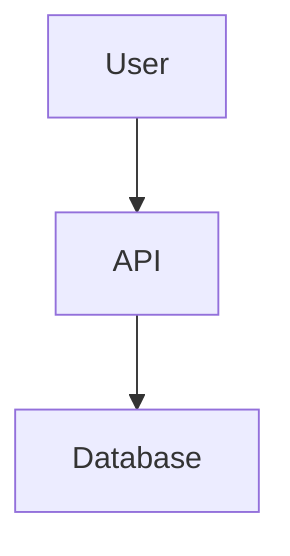
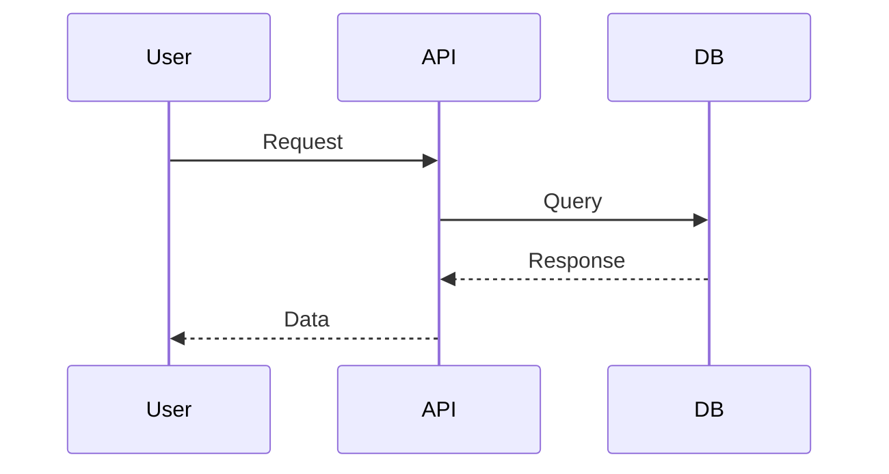
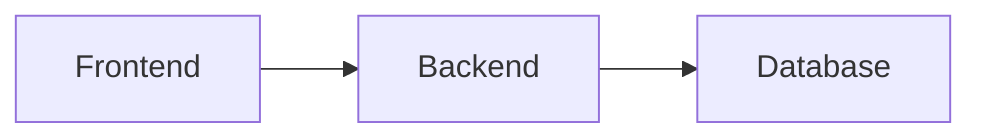
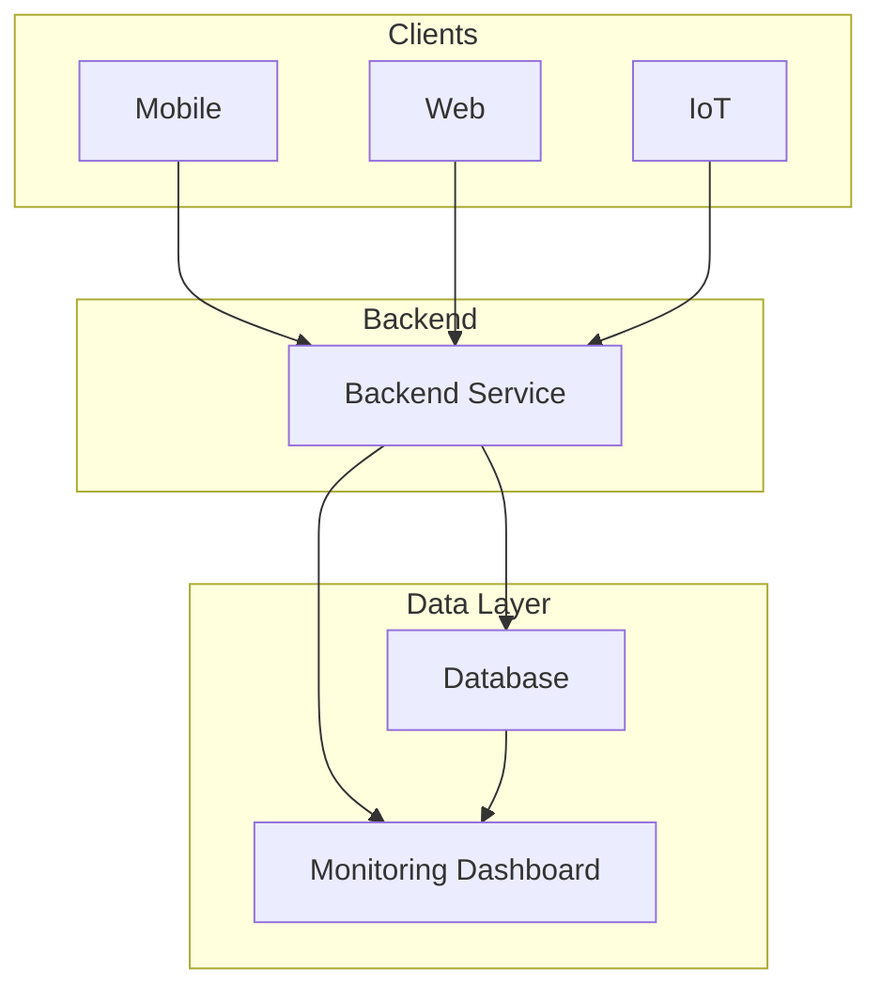

# What is Markdown?

**List of tips**

1. **Two asteriks emphasize**
2. _One asterik italicizes_
3. ~~Strikethrough~~

- Unordered list
- Another unordered list

# Heading 1

## Heading 2

### Heading 3

#### Heading 4

##### Heading 5

###### Heading 6

[Google](https://google.com)


| Image 1                                                                                              | Image 2                                                                                              | Image 3                                                                                           |
| ---------------------------------------------------------------------------------------------------- | ---------------------------------------------------------------------------------------------------- | ------------------------------------------------------------------------------------------------- |
|  |  |  |

`console.log("hello")`

```javascript
function hello() {
  console.log("hello");
}
```

> Ceci est une citation

---









Title of My Document
====================

Sub-Title of My Document
------------------------

My favorite color is `#f81312`

This site was built using [GitHub Pages](https://pages.github.com/).

# Example headings

## Sample Section

## This'll be a _Helpful_ Section About the Greek Letter Θ!
A heading containing characters not allowed in fragments, UTF-8 characters, two consecutive spaces between the first and second words, and formatting.

## This heading is not unique in the file

TEXT 1

## This heading is not unique in the file

TEXT 2

# Links to the example headings above

Link to the sample section: [Link Text](#sample-section).

Link to the helpful section: [Link Text](#thisll-be-a-helpful-section-about-the-greek-letter-Θ).

Link to the first non-unique section: [Link Text](#this-heading-is-not-unique-in-the-file).

Link to the second non-unique section: [Link Text](#this-heading-is-not-unique-in-the-file-1).

- [x] `#739`
- [ ] https://github.com/octo-org/octo-repo/issues/740
- [ ] Add delight to the experience when all tasks are complete :tada:


| Header 1 | Header 2 | Header 3 |

`Salut`

Here is a simple footnote[^1].

A footnote can also have multiple lines[^2].

[^1]: My reference.
[^2]: To add line breaks within a footnote, add 2 spaces to the end of a line. This is a second line.